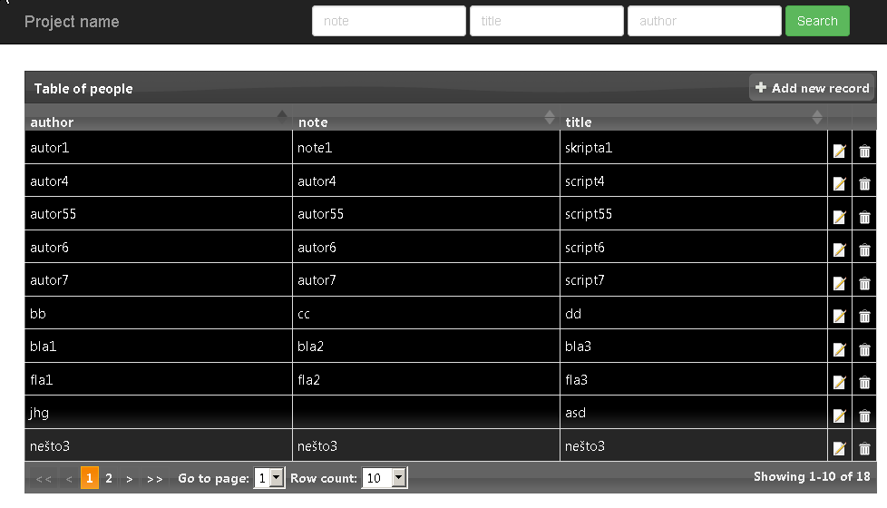

Short overview:
===============

What is this?
-------------

Simple node.js CRUD experimental application.

What is utilized?
-------------------

*	Express  (http://expressjs.com/)
*	 jTable (http://www.jtable.org/)
*	jquery-ui (http://jqueryui.com/)
*	twitter bootstrap (http://getbootstrap.com/2.3.2/) 
*	bcrypt-nodejs (https://www.npmjs.org/package/bcrypt-nodejs)
*	connect-flash (https://github.com/jaredhanson/connect-flash)
*	ejs (http://embeddedjs.com/)
*	mongodb (https://github.com/mongodb/node-mongodb-native)
*	passport (http://passportjs.org/)
*	validator (https://github.com/chriso/validator.js)
*	winston (https://github.com/flatiron/winston)
*	step.js (https://www.npmjs.org/package/step)
*	(Developed on Windows 7 OS)

How to run?
-----------

*	Install mongodb
*	Start mongod.exe 
*	Recreate database 
    (Run 'mongorestore' command. Database dump is in '~/doc/DB BCKP')
*	Install Node.js and NPM (Node package manager)
*	Run 'npm install' command to install all node.js modules (dependencies)
*	Credentials: 
	*	username: 'admin' 
	*	password: 'x12345'
* Run 'node app' command
